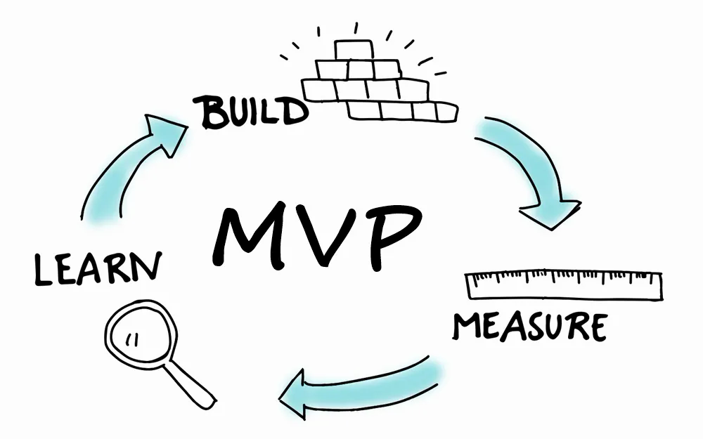

# DevOps Prozesse

## SDLC (Software Development Life Cycle)

SDLC ist ein strukturierter Entwicklungszyklus bestehend aus mehreren Phasen, die Software von der Konzeptentwicklung bis zum produktiven Betrieb begleiten.

- Die **typischen Phasen** sind Analyse & Planung, Design & Konzeption, Implementierung, Testing, Kompilierung & Packaging, Bereitstellung und Wartung.
- Jede Phase hat eigene Ziele: Vom Sammeln und Analysieren der Anforderungen über die konkrete Umsetzung, Tests auf Funktionalität bis zur Übergabe in die Produktivumgebung und fortlaufenden Wartung.
- Der SDLC wird durch Projektmanagement-Methoden (z.B. Wasserfall, Agile) gesteuert und gibt vor, wann welche Phase durchlaufen und dokumentiert wird, sowie welche Qualitätsmassstäbe gelten.

## DevOps Lifecycle

Der DevOps Lifecycle ist eine kontinuierliche Methode, die Entwicklung und Betrieb vereint und Automatisierung sowie Zusammenarbeit fördert.

- Die **Phasen** des DevOps Lifecycle sind: Planning, Coding, Build, Testing, Release, Deploy, Operate, und Monitor in einer Endlosschleife.
- Ziel ist es, eine schnellere, zuverlässigere und kontinuierliche Softwarelieferung zu gewährleisten und durch Feedback aus Betrieb sowie Nutzeranalyse eine laufende Verbesserung zu ermöglichen.

## Unterschiede zwischen SDLC und DevOps Lifecycle

SDLC und DevOps unterscheiden sich grundlegend in Prozess, Fokus und Zielsetzung.

- **SDLC**: Linear/Phasenorientiert, mit klaren Übergängen, stark prozessgesteuert und dokumentiert, Fokus auf Qualitätssicherung innerhalb einzelner Entwicklungsstufen.
- **DevOps**: Kontinuierlich, integriert Entwicklung und Betrieb, fördert Automatisierung und schnelle Reaktion auf Feedback, setzt auf enge Zusammenarbeit und Iterationen.
- Auswirkungen: DevOps ermöglicht flexiblere, schnellere Auslieferung, geringere Fehlerquoten durch frühes und fortlaufendes Testen, bessere Skalierbarkeit sowie schnellere Marktanpassungen.

## MVP (Minimum Viable Product) im DevOps Lifecycle

Ein **MVP** ist ein Produkt mit möglichst geringem, aber ausreichend wertvollem Funktionsumfang, um erste Nutzerreaktionen zu erhalten.

- Kernmerkmale: Das MVP enthält nur essentielle Funktionen, ist einfach und schnell realisierbar, der Fokus liegt auf schnellem Bereitstellen und Lernen aus Nutzerfeedback.
- Rolle im DevOps Lifecycle: Das MVP wird früh in den Entwicklungsprozess eingebracht, mit den DevOps-Prinzipien kontinuierlich verbessert; schnelles Feedback aus dem Monitoring fliesst direkt in neue Iterationen ein, was Innovation und Nutzerzentrierung fördert.

Das Beispiel zeigt, dass ein MVP nicht nur ein unvollständiger Teil des Endprodukts sein sollte (oben), sondern bereits von Anfang an einen echten Nutzen bieten muss (unten). Statt erst ein Auto in Einzelschritten wie Achsen und Karosserie zu entwickeln, wird der Nutzen "Fortbewegung" direkt in Form eines Skateboards, Fahrrads oder Motorrads geliefert und schrittweise verbessert.

## Quellen

- [GeeksforGeeks – DevOps Lifecycle](https://www.geeksforgeeks.org/devops/devops-lifecycle/)
- [AWS – Was ist SDLC?](https://aws.amazon.com/de/what-is/sdlc/)
- [Atlassian – DevOps](https://www.atlassian.com/de/devops)
- [Rapid7 – Software Development Life Cycle (SDLC)](https://www.rapid7.com/de/cybersecurity-grundlagen/software-development-life-cycle-sdlc/)
- [BrowserStack – DevOps Lifecycle](https://www.browserstack.com/guide/devops-lifecycle)
- [Splunk – Software Development Lifecycle (SDLC)](https://www.splunk.com/de_de/blog/learn/software-development-lifecycle-sdlc.html)
- [GitLab – DevOps](https://about.gitlab.com/de-de/topics/devops/)
- [JFrog – SDLC](https://jfrog.com/de/learn/sdlc/)
- [Medium – What is Minimum Viable Data Product?](https://medium.com/idealo-tech-blog/what-is-minimum-viable-data-product-49269e338d85)
