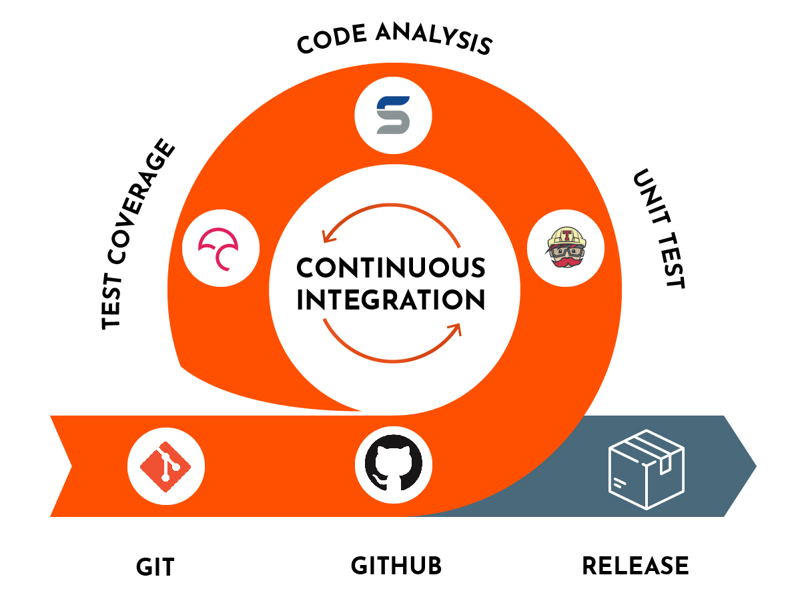

## Continuous Integration (CI)

**Continuous Integration (CI)** ist ein grundlegendes Prinzip der modernen Softwareentwicklung. Dabei werden Codeänderungen regelmässig und automatisiert in den Hauptzweig(main branch) integriert. Jede Änderung durchläuft einen automatischen Prozess mit **Builds**, **Tests** und **Qualitätsprüfungen**, sodass Fehler frühzeitig erkannt und behoben werden können.

### Vorteile von CI

- **Frühe Fehlererkennung** durch automatisierte Tests
- **Höhere Qualität** und Stabilität der Software
- **Bessere Zusammenarbeit** im Team durch häufige Integration
- **Grundlage für Continuous Delivery/Deployment**

CI ist heute **sehr hilfreich und nicht mehr wegzudenken**, da es Entwicklungsteams ermöglicht, schneller, effizienter und mit weniger Risiko zu arbeiten.

### Umsetzung im Betrieb

In unserem Betrieb setzen wir **GitHub Actions** als CI-Lösung ein. Jede Codeänderung wird automatisch gebaut und getestet.  
Zusätzlich betreiben wir ein **eigenes Artifact-Repository**, in dem erstellte Artefakte (z. B. Libraries, Container-Images) versioniert und sicher gespeichert werden. Dadurch sind unsere Builds reproduzierbar und auch langfristig nachvollziehbar.

Diese Kombination sorgt für eine **zuverlässige, stabile und automatisierte Entwicklungs- und Delivery-Pipeline**, die unseren Workflow erheblich verbessert.

### Quellen

- [Martin Fowler – Continuous Integration](https://martinfowler.com/articles/continuousIntegration.html)
- [Atlassian: What is CI/CD?](https://www.atlassian.com/continuous-delivery/ci-vs-ci-vs-cd)
- [GitHub Actions Documentation](https://docs.github.com/en/actions)
